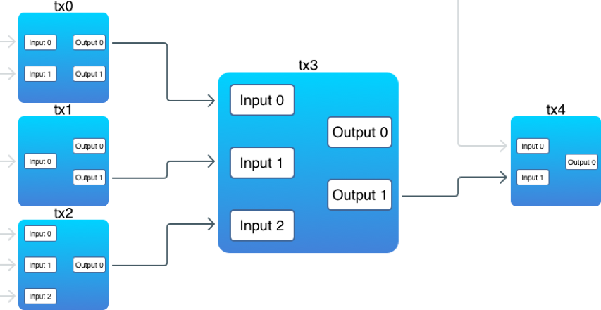
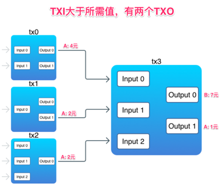
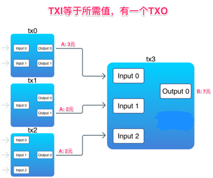

交易1
==================

## 引言 

交易是比特币的核心，而blockchain的唯一目的就是安全可靠地存储交易信息，确保创建交易后，没人可以修改该交易信息。今天，让我们来实现交易。由于交易是个非常大的主题，因此将分两部分介绍。第一部分实现交易的框架，第二部分实现更过细节。

## There is no spoon

Web应用一般需要创建如下数据表用于实现支付逻辑：账户表（accounts）、交易表（transactions）。accounts用于存储用户信息，如个人信息、账户余额；transactions用于存储资金的流动信息，如由谁支付给谁多少钱。比特币的实现则完全不同：

1. 没有账户
2. 没有余额
3. 没有地址信息
4. 没有货币信息
5. 没有付款人、收款人

由于blockchain是完全开放、公开的，因此我们不希望存储任何用户敏感信息。账户中不包含任何交易额信息。交易也不会将钱从一个账户转到另一个账户，也不存储任何账户余额信息。仅有的就是交易信息，交易信息到底有什么呢？

## 比特币交易

一个交易由多个输入和输出：

```JavaScript
class Transaction {
  constructor() {
    this.id = null;
    this.vIn = [];
    this.vOut = [];
  }
}
```

交易输入（下文称TXI）均与之前交易的输出（下文称TXO）相关联（存在一个例外情况，后续讨论）；TXO存储交易额。下图展示了交易间相互关联的情况：



注意：

1. 有一些输出并没有被关联到某个输入上
2. 一笔交易的输入可以引用之前多笔交易的输出
3. 一个输入必须引用一个输出

贯穿本文，我们将会使用像“钱（money）”，“币（coin）”，“花费（spend）”，“发送（send）”，“账户（account）” 等等这样的词。但是在比特币中，其实并不存在这样的概念。交易仅仅是通过一个脚本（script）来锁定（lock）一些值（value），而这些值只可以被锁定它们的人解锁（unlock）。

一个交易包括付款方和收款方，因此交易中的TXI都是付款方，而交易中的TXO有两种情况： ** 若TXI的总额正好和所需值相等，那么交易只有一个TXO，该TXO属于收款方；若TXI的总额大于所需值，那么交易有两个TXO，一个属于收款方，一个属于付款方。 ** （FindUnspentTransactions方法利用这个特点来获取某个地址（账户）的UTXO）：




## 交易输出（TXO）

```JavaScript
class TXOutput {
  constructor(value, script) {
    this.value = value;
    this.scriptPubKey = script;
  }
}
```

输出主要包含两部分：

1. 一定量的比特币(`Value`)
2. 一个锁定脚本(`ScriptPubKey`)，要花这笔钱，必须要解锁该脚本。

实际上，正是输出里面存储了“币”（注意，也就是上面的 `Value` 字段）。而这里的存储，指的是用一个数学难题对输出进行锁定，这个难题被存储在 `ScriptPubKey` 里面。在内部，比特币使用了一个叫做 *Script* 的脚本语言，用它来定义锁定和解锁输出的逻辑。虽然这个语言相当的原始（这是为了避免潜在的黑客攻击和滥用而有意为之），并不复杂，但是我们也并不会在这里讨论它的细节。你可以在[这里](https://en.bitcoin.it/wiki/Script) 找到详细解释。


>在比特币中，`value` 字段存储的是 *satoshi* 的数量，而不是 BTC 的数量。一个 *satoshi* 等于一亿分之一的 BTC(0.00000001 BTC)，这也是比特币里面最小的货币单位（就像是 1 分的硬币）。

由于还没有实现地址（address），所以目前我们会避免涉及逻辑相关的完整脚本。`ScriptPubKey` 将会存储一个任意的字符串（用户定义的钱包地址）。

>顺便说一下，有了一个这样的脚本语言，也意味着比特币其实也可以作为一个智能合约平台。

关于输出，非常重要的一点是：它们是**不可再分的（indivisible）**。也就是说，你无法仅引用它的其中某一部分。要么不用，如果要用，必须一次性用完。当一个新的交易中引用了某个输出，那么这个输出必须被全部花费。如果它的值比需要的值大，那么就会产生一个找零，找零会返还给发送方。这跟现实世界的场景十分类似，当你想要支付的时候，如果一个东西值 1 美元，而你给了一个 5 美元的纸币，那么你会得到一个 4 美元的找零。


## 交易输入（TXI）

```JavaScript
class TXInput {
  constructor(txId, value, script) {
    this.txId = txId;
    this.vOut = value;
    this.scriptSig = script;
  }
}
```

如上所述，TXI与之前的某个TXO相关联：**txId** 存储输出所属的交易的ID，**vOut** 存储输出的序号（一个交易可以包括多个TXO）。scriptSig存储一个脚本，与之关联的TXO的 **ScriptPubKey** 就来源于该脚本，因此两者可以进行校验：如果校验正确，与之关联的TXO被解锁并生成新的TXO；如果校验不正确，TXO压根不能够被TXI所引用。该机制保证钱只能被其拥有者使用，而不能被其他人使用。
由于我们还没有实现地址（钱包），**scriptSig** 仅仅存储用户自定义的字符串而已，后续我们将实现公钥和签名核查。
综上所述，TXO存储交易额，同时拥有一个解锁脚本。每个交易至少拥有一个TXI和一个TXO。TXI的scriptSig和TXO的scriptPubKey进行校验，验证成功后可以解锁交易输出，并创建新的TXO。
那么问题来了：先有TXI还是先有TXO？

## 先有蛋后有鸡

比特币中，TXI关联TXO的逻辑和经典的“先有鸡还是先有蛋”的问题是一样的。比特币是先有蛋（TXO）后有鸡（TXI），TXO先于TXI出现。

当blockchain的首个block（即genesis block）被挖到后，会生成一个coinbase交易。coinbase交易是一种特殊的交易，该TXI不会引用任何TXO，而会直接生成一个TXO，这是作为奖励给矿工的。

Blockchain以genesis block开头，该block生成blockchain中第一个TXO。由于之前没有任何交易，因此该TXI不会与任何TXO关联。

下面创建一个coinbase交易：

```JavaScript
  static NewCoinbaseTX(to, data) {
    if (!data || data == '') {
      data = `Reward to ${to}`;
    }

    let txIn = new TXInput(null, -1, data);
    let txOut = new TXOutput(Transaction.SUBSIDY, to);
    let transaction = new Transaction();
    transaction.vIn.push(txIn);
    transaction.vOut.push(txOut);

    transaction.setId();

    return transaction; 
  }
```

coinbase仅有一个TXI，该TXI的**txId**为空，**value**设置为-1，同时**scriptSig**中存储的不是脚本，而仅仅是一个普通字符串。

>比特币中，第一个coinbase交易包含如下信息“The Times 03/Jan/2009 Chancellor on brink of second bailout for banks”

**Subsidy**是挖矿的奖励值，比特币中，该奖励值是基于总block数量计算得到的。挖出genesis奖励50BTC，每挖出210000个block，奖励值减半。我们的实现中，该奖励值是一个常量。

## 交易

从现在开始，每个block至少包含一个交易，Block结构中的Data字段江永Transactions字段代替。

```JavaScript

  constructor(timestamp, transactions, prevBlockHash, hash) {
    this.timestamp = timestamp;
    this.transactions = transactions;
    this.prevBlockHash = prevBlockHash;
    this.hash = hash;
    this.nonce = 0;
  }

```

**NewBlock**和**NewGenesisBlock**方法也需要修改：

```JavaScript

  static NewBlock(transactions, prevBlockHash) {
    let block = new Block(Date.now(), transactions, prevBlockHash);
    let pow = POW.NewProofOfWork(block);
    let powResult = pow.run();
    block.hash = powResult.hash;
    block.nonce = powResult.nonce;
    // block.setHash();
    return block;
  }


  newGenesisBlock() {
    return Block.NewBlock([], ``);
  }

```

同时，修改 **blockchain.js** 里面的 函数：
```JavaScript

  static NewBlockChain(address) {
    // get db instance
    let store = new InCache({
      storeName: "blockchain",
      autoSave: true,
      autoSaveMode: "timer"
    });

    let bc;

    // check db
    let lastHash = store.get('l');
    if (!lastHash) {
      bc = new BlockChain();
      let tx = Transaction.NewCoinbaseTX(address, genesisCoinbaseData);
      let block = bc.newGenesisBlock(tx);

      store.set(block.hash, block.toString());
      store.set('l', block.hash);
      lastHash = block.hash;
    } else 
      bc = new BlockChain();
    bc.db = store;
    bc.tip = lastHash;

    return bc;
  }
  
```

数据库的第一个genesisBlock接收一个地址，并且默认写下一句话“The Times 03/Jan/2009 Chancellor on brink of second bailout for banks”。

## 工作量证明

为了保证blockchain的一致性和可靠性，PoW算法必须要考虑block中的交易信息，**ProofOfWork.prepareData**需要做如下修改：

```JavaScript

  prepareData(nonce) {
    return this.block.prevBlockHash + "" 
    + this.block.hashTransaction() + ""   // 这个函数待会儿给出
    + this.block.timestamp + "" 
    + POW.trgetBits + "" 
    + nonce;
  }
  
```

现在使用pow.block.HashTransactions()代替pow.block.Data：

```JavaScript

  // 在block.js增加函数
  hashTransaction() {
    let txHashes = "";
    for (let i = 0; i < this.transactions.length; i++) {
      txHashes += JSON.stringify(this.transactions[i]);
    }

    let sha256 = new Hashes.SHA256();
    hash = sha256.hex(txHashes);
    return hash;
  }

```

我们遍历所有交易，获取每个交易的hash值，然后将所有交易的hash值组合后最终得到一个代表block中整个交易的hash值，计算整个block的hash值时会引用该值。

>比特币使用了一个更加复杂的技术：它将一个块里面包含的所有交易表示为一个  [Merkle tree](https://en.wikipedia.org/wiki/Merkle_tree) ，然后在工作量证明系统中使用树的根哈希（root hash）。这个方法能够让我们快速检索一个块里面是否包含了某笔交易，即只需 root hash 而无需下载所有交易即可完成判断。

给cli.js增加如下代码:

```JavaScript

program
  .command('addblockchain')
  .description('addblockchain for address')
  .option("-s, --address [addr]", "Which address to use")
  .action(function(options){
    var addr = options.address || "";
    let bc = BlockChain.NewBlockChain(addr);

    let iterator = bc.getBlockIterator();
    let currBlock = iterator.curr();
    console.log(currBlock);
    while(iterator.hasNext()) {
      let prev = iterator.next();
      console.log(prev);
    }
  });

program.parse(process.argv);

```
之后尝试运行:
``` node src/cli.js addblockchain -s Ivan ```
可得到正确结果。

很好！我们已经获得了第一笔挖矿奖励，但是，我们要如何查看余额呢？

## 未花费交易输出

我们需要找到所有的未花费交易输出（unspent transactions outputs, UTXO）。**未花费（unspent）** 指的是这个输出还没有被包含在任何交易的输入中，或者说没有被任何输入引用。在上面的图示中，未花费的输出是：

1. tx0, output 1;
2. tx1, output 0;
3. tx3, output 0;
4. tx4, output 0.

当然了，检查余额时，我们并不需要知道整个区块链上所有的 UTXO，只需要关注那些我们能够解锁的那些 UTXO（目前我们还没有实现密钥，所以我们将会使用用户定义的地址来代替）。首先，让我们定义在输入和输出上的锁定和解锁方法：

```JavaScript

  // transaction.js

  // TXInput

  // unlockingData 理解为地址
  canUnlockOutputWith(unlockingData) {
    return this.scriptSig == unlockingData;  
  }

  // TXOutput
  canBeUnlockedWith(unlockingData) {
    retrn this.scriptPubKey == unlockingData;
  }

```

在这里，我们只是将 script 字段与 `unlockingData` 进行了比较。在后续文章我们基于私钥实现了地址以后，会对这部分进行改进。

下一步，找到包含未花费输出的交易，这一步其实相当困难：

``` JavaScript

  
  findUnspentTransactions(address) {
    let unspentTXs = [];

    let spentTXOs = {};

    let iterator = this.getBlockIterator();
    while(iterator.hasNext()) {
      let block = iterator.next();

      for (let i = 0; i < block.transactions.length; i++) {
        let tx = block.transactions[i];
        let txId = tx.id;

        for (let outIdx = 0; outIdx < tx.vOut.length; outIdx++) {

          // 如果被花费掉了
          let needToBreak = false;

          // 任何tx，只要有输入，都会被放在spentTXOs里。在稍下面代码里。这里要判断是否已经花费
          if (spentTXOs[txId] != null && spentTXOs[txId] != undefined) {
            for (let j = 0; j < spentTXOs[txId].length; j++) {
              if (spentTXOs[txId][j] == outIdx) {
                needToBreak = true;
                break;
              }
            }
          }

          if (needToBreak) {
            continue;
          }

          let out = tx.vOut[outIdx];
          if (out.canBeUnlockedWith(address)) {
            unspentTXs.push(tx);
          }
        }

        if (tx.isCoinbase() == false) {
          for (let k = 0; k < tx.vIn.length; k ++) {
            let vIn = tx.vIn[k];
            if (vIn.canUnlockOutputWith(address)) {
              let vInId = vIn.txId;
              if (!spentTXOs[vInId]) {
                spentTXOs[vInId] = [];
              }
              spentTXOs[vInId].push(vIn.vOut);
            }
          }
        }
      }
    }

    return unspentTXs;
  }

```

交易存储在block中，我们需要遍历blockchain中的每一个block：

``` JavaScript
  
  if (out.canBeUnlockedWith(address)) {
    unspentTXs.push(tx);
  }

```

如果TXO是被指定地址锁定的，该TXO会作为候选TXO继续进行处理：

``` JavaScript
  
  if (spentTXOs[txId] != null && spentTXOs[txId] != undefined) {
    let needToBreak = false;
    for (let j = 0; j < spentTXOs[txId]; j++) {
      if (spentTXOs[txId][j] == outIdx) {
        needToBreak = true;
        break;
      }
    }
  }

```

对于已经被TXI引用的TXO，不做处理；对于未被TXI引用的TXO，即UTXO，将包含其的交易保存到交易列表中。对于coinbase交易，不需要遍历TXI，因为其TXI不会引用任何TXO。

``` JavaScript
  
  if (tx.isCoinbase() == false) {
    for (let k = 0; k < tx.vIn; k ++) {
      let vIn = tx.vIn[k];
      if (vIn.canUnlockOutputWith(address)) {
        let vInId = vIn.txId;
        if (!spentTXOs[vInId]) {
          spentTXOs[vInId] = [];
        }
        spentTXOs[vInId].push(vIn.vOut);
      }
    }
  }

```

最终，该函数返回包含UTXO的交易列表。通过接下来的函数，进一步处理，最终返回TXO列表。

``` JavaScript
  
  findUTXO(address) {
    let UTXOs = [];
    let txs = this.findUnspentTransactions(address);

    for (let i = 0; i < txs.length; i ++) {
      for (let j = 0; j < txs[i].vOut.length; j ++) {
        if (txs[i].vOut[j].canBeUnlockedWith(address)) {
          UTXOs.push(txs[i].vOut[j]);
        }
      }
    }
    return UTXOs;
  }

```

OK！下面实现getbalance命令：

``` JavaScript
  
program
  .command('getBalance')
  .description('getBalance for address')
  .option("-s, --address [addr]", "Which address to use")
  .action(function(options){
    var addr = options.address || "";
    let bc = BlockChain.NewBlockChain(addr);

    let UTXOs = bc.findUTXO(addr);
    let amount = 0;
    for (let i = 0; i < UTXOs.length; i ++) {
      amount += UTXOs[i].value;
    }

    console.log(`Balance of ${addr}: ${amount}`);
  });

```

账户余额就是属于该账户的所有UTXO的总和。

Ivan挖到genesis block后，其账户余额为10：

```
  //删除本地数据库之后，运行
  node src/cli.js addblockchain -s Ivan

  //之后运行下面这段获取余额
  node src/cli.js getBalance --address Ivan
```

## 发送币

货币流动起来才创造价值，为了达成此目的，我们需要创建一个交易，将该交易放到一个block中，然后通过挖矿挖到（PoW）该block。目前为止，我们仅仅实现了coinbase这种特殊的交易，下面我们实现通用的交易：

```JavaScript

  // transaction.js

  static NewUTXOTransaction(fromAddr, to, amount, bc) {
    let inputs = [];
    let outputs = [];

    let obj = bc.findSpendableOutputs(fromAddr, amount);
    let acc = obj.amount;
    let outputs = obj.unspentOutputs;

    if (acc < amount) {
      console.log(`ERROR: Not enough funds`);
      return;
    }

    for (let txId in outputs) {
      let outs = outputs[txId];
      for (let key in outs) {
        let outIdx = outs[key];
        let input = new TXInput(txId, outIdx, fromAddr);
        inputs.push(input);
      }
    }

    outputs.push(new TXOutput(amount, to));

    if (acc > amount) {
      outputs.push(new TXOutput(acc - amount, fromAddr));
    }

    let tx = new Transaction();
    tx.vIn = inputs;
    tx.vOut = outputs;
    tx.setId();

    return tx;
  }

```


在创建新的输出前，我们首先必须找到所有的未花费输出，并且确保它们有足够的价值（value），这就是 `FindSpendableOutputs` 方法要做的事情。随后，对于每个找到的输出，会创建一个引用该输出的输入。接下来，我们创建两个输出：

1. 一个由接收者地址锁定。这是给其他地址实际转移的币。

2. 一个由发送者地址锁定。这是一个找零。只有当未花费输出超过新交易所需时产生。记住：输出是**不可再分的**。

`FindSpendableOutputs` 方法基于之前定义的 `FindUnspentTransactions` 方法：

```JavaScript

  // blockchain.js

  findSpendableOutputs(address, amount) {
    let unspentOutputs = {};
    let unspentTxs = this.findUnspentTransactions(address);
    let accumulated = 0;

    for (let key in unspentTxs) {
      let tx = unspentTxs[key];
      let txId = tx.id;

      let needBreak = false;
      for (let outIdx = 0; outIdx < tx.vOut.length; outIdx ++) {
        let output = tx.vOut[outIdx];
        if (output.canBeUnlockedWith(address) && accumulated < amount) {
          accumulated += output.value;
          if (!unspentOutputs[txId]) 
            unspentOutputs[txId] = [];
          unspentOutputs[txId].push(outIdx);
          if (accumulated >= amount) {
            needBreak = true;
            break;
          }
        }
      }

      if (needBreak)
        break;
    }

    return {
      amount: accumulated,
      unspentOutputs: unspentOutputs
    };
  }

```


这个方法对所有的未花费交易进行迭代，并对它的值进行累加。当累加值大于或等于我们想要传送的值时，它就会停止并返回累加值，同时返回的还有通过交易 ID 进行分组的输出索引。我们只需取出足够支付的钱就够了。

现在，我们可以修改 `Blockchain.MineBlock` 方法：

```JavaScript

  mineBlock(txs) {
    let lastHash = this.db.get('l');
    let newBlock = Block.NewBlock(txs, lastHash);
    this.db.set(newBlock.hash, newBlock.toString());
    this.db.set('l', newBlock.hash);
    this.tip = newBlock.hash;
  }

```

最后，让我们来实现 `send` 方法：

```JavaScript

program
  .command('send')
  .description('send value')
  .option("-s, --sendAddress [sendAddress]", "Which address to use")
  .option("-t, --toAddress [toAddress]", "Which address to use")
  .option("-v, --value [value]", "Value")
  .action(function(options){
    let sendAddr = options.sendAddress;
    let toAddr = options.toAddress;
    let value = options.value;

    let bc = BlockChain.NewBlockChain();
    let tx = Transaction.NewUTXOTransaction(sendAddr, toAddr, value, bc);
    bc.mineBlock([tx]);

    console.log(`Success!`);
  });

```

消费意味着创建一个交易，然后挖一个block存储该交易，并将block添加到blockchain中。但是比特币的做法不同：比特币不会为一个新的交易马上去挖矿，而是会先将新交易缓存内存池mempool，当矿工即将挖矿时，从内存池中将所有交易取出，整体放到block中，并添加到blockchain。

让我们尝试进行一些交易：

```Shell
  
  // 初始化block
  // 之前先手动删除.incache文件
  node src/cli.js addblockchain -s Ivan

  // 开始发送coin
  node src/cli.js send -s Ivan -t Jay -v 2
  node src/cli.js send -s Ivan -t Jay -v 4
  node src/cli.js send -s Ivan -t Jay -v 1

  //结果
  node src/cli.js getBalance --address Jay

  node src/cli.js getBalance --address Ivan

```

## 总结

哇！经历重重困难，我们现在终于实现了交易了！不过，我们仍然缺少了比特币这类数字货币的一些关键特性：
>1. 地址（账户/钱包）：仍没有基于私钥的地址
>2. 奖励：挖矿应该给予响应的奖励
>3. UTXO集合：在我们的实现中，为了获取余额需要遍历整个blockchain，效率非常低。此外，如果我们想验证交易，也会很慢。UTXO集合可以解决上述问题。
>4. Mempool：在我们的实现中，一个block仅仅包含一个交易，利用率不高。Mempool用于缓存多个交易然后打包到一个block中，从而提高利用率。